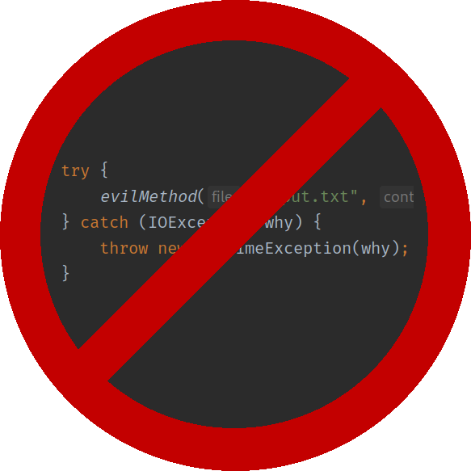

This repository contains a Java compiler plugin and an IntelliJ plugin.
The former disables exception checking in javac and the latter disables exception checking in the IDE.

These plugins enable code like
```java
public static void evilMethod() {
    Files.writeString(Path.of("file.txt"), "text");
    throw new IOException();
}
```
to be compiled successfully.

### Using the IntelliJ plugin
Not yet published to the plugin marketplace.

### Using the compiler plugin
It is hosted as `net.auoeke:uncheck` at https://maven.auoeke.net.

#### Gradle
```groovy
repositories {
    maven {url = "https://maven.auoeke.net"}
}

dependencies {
    annotationProcessor("net.auoeke:uncheck:0.0.1")
}
```


